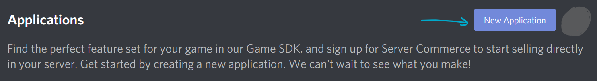
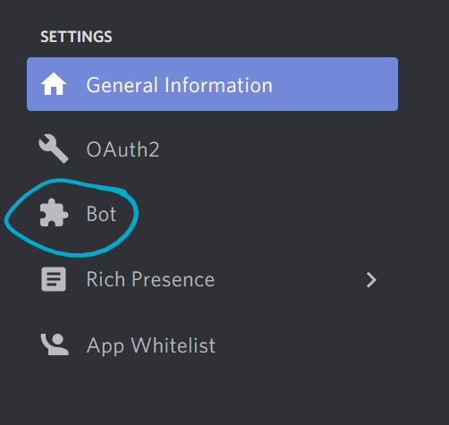
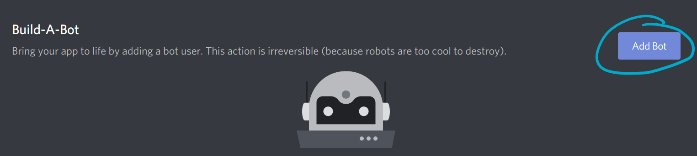
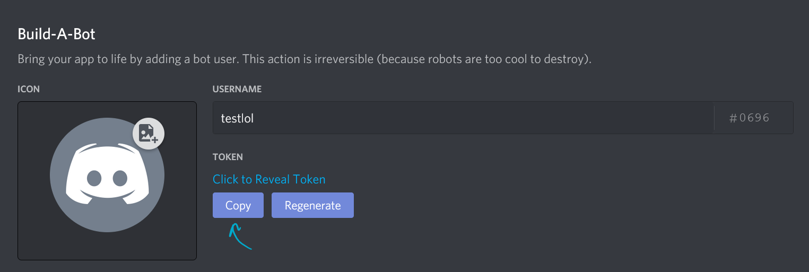
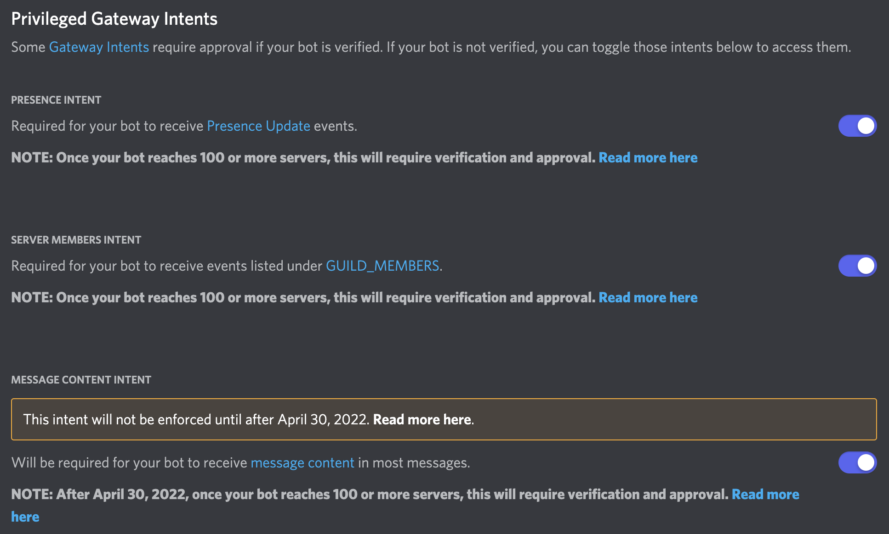
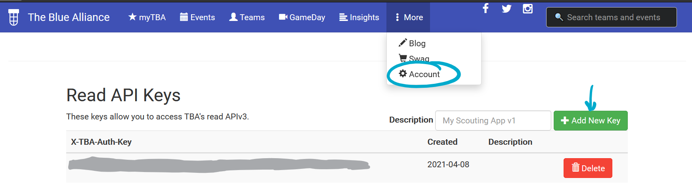
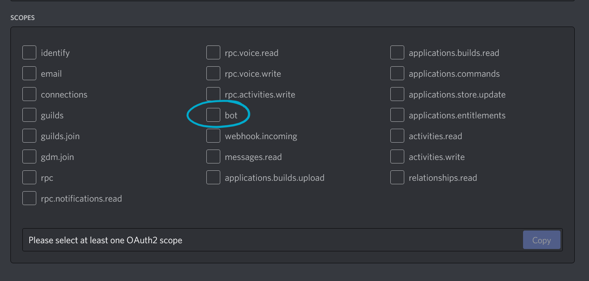
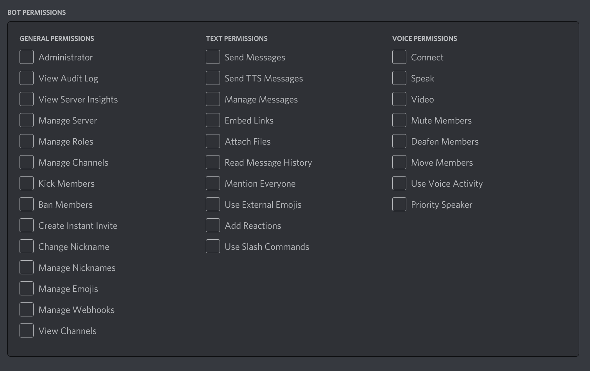
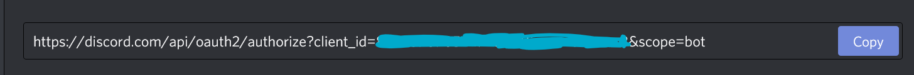

# FRCBot
A feature-rich Discord bot for FRC teams

## Table of Contents
- [Add Hosted Instance to Server](#add-hosted-instance-to-server)
- [Setup](#setup)
	- [Install Node.js and NPM](#install-nodejs-and-npm)
	- [Install Dependencies](#install-dependencies)
	- [Get Discord Bot Token](#get-discord-bot-token)
	- [Get TBA API Key](#get-tba-api-key)
	- [Configure](#configure)
	- [Add to Server](#add-to-server)
	- [Run the Bot](#run-the-bot)

## Add Hosted Instance to Server
FRC Bot provides a hosted instance of the bot at [frcbot.togatech.org](https://frcbot.togatech.org). If you want to host your own instance of the bot, please see the [setup guide](#setup) below.

## Setup
Some parts of this setup guide have been borrowed from the [FRC Discord Dozer bot documentation](https://github.com/frcdiscord/dozer#setup) and adapted for FRC Bot.

### Install Node.js and NPM
Run `node -v` to find what version of Node.js you are running and `npm -v` to find what version of NPM you are running. If you don't have Node.js or NPM, one of these commands will return an error, and you'll need to install from [nodejs.org](https://nodejs.org/).

### Install Dependencies
Open a terminal and navigate to the root directory of FRC Bot. Run `npm i` to install the dependencies used by FRC Bot.

### Get Discord Bot Token
1. Go to the [Discord Developer Portal](https://discord.com/developers/applications) and create a new application by clicking the button. Enter a name for the application when prompted.
    

2. Create a bot user inside of your application. 
   In the settings menu, go to the "Bot" menu.
   
   
   Within the bot menu, select the "Add bot" option.
   

3. Copy and save the bot user token (seen in the image below), you'll need it later.
   Do not share your token with anyone. If someone obtains your bot user token, they gain full control of your bot. Be careful!
   

4. Within your bot user settings, make sure all "intents" settings are enabled.
   

### Get TBA API Key
1. Create a TBA account using your Google Account. Go to [thebluealliance.com](https://www.thebluealliance.com), click the myTBA tab, and click the "Log in" button.

2. Go to the "More" tab at the top of the page and select the "Account" option. From there, scroll down to "Read API Keys," enter a description for your bot, and select "Add New Key."

3. Copy and save this API key, you'll need it later.

### Configure
Copy `exampleconfig.json` over to `config.json` and open the file in either a code editor or a plain text editor (but not a rich text editor). Paste your Discord Bot token in the empty `token` field and your TBA API key in the empty `tba_key` field. Feel free to modify the other fields like `prefix` and `footer` to further customize your bot.

### Add to Server
1. Within the scopes menu under OAuth2, select the "bot" scope.
   
2. A new "permissions" menu should appear below. Select all the permissions that you want your instance of FRC Bot to have. If you want all permissions and you trust your instance wholeheartedly, select the "Administrator" option.
   
3. The bottom of the scopes menu should have a URL. Copy and paste that URL into a new tab in your browser. It'll open a page where you can invite the bot to your server.
   

### Run the Bot
Open a terminal and navigate to the root directory of FRC Bot. Run `npm start` to run the bot!